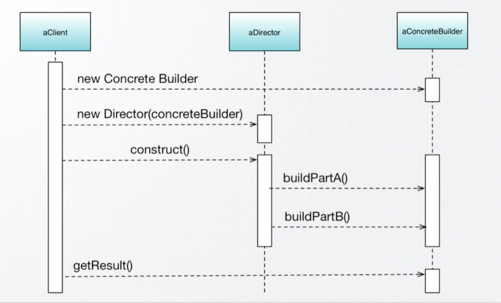

#Builder
##Details
###Issues
- Search screen result in three objects
    - One for each database
- Need to construct the three object **over and over again**
###Future proof
- Ideally we would like to **support a fourth database without changing too much code**
##Consequences
###Benefits
- Uniform production creation via an inteerface
- Abstract building process
- Loose coupling
    - Construction
    - Representation
- Finer control on the build process -> Allow multiple steps
##Diagram
See de diagram for better understanding

